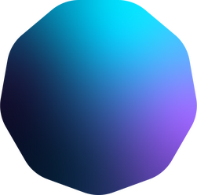

# Immersa

<p align="center">
  
</p>

**A Web-based 3D Presentation Tool** - Create stunning 3D presentations with animated transitions between slides.

## What is Immersa?

Immersa is an innovative presentation tool that brings your presentations into the third dimension. Unlike traditional slide-based tools, Immersa allows you to:

- **Load 3D Models**: Import `.glb` 3D models into your presentation
- **Add Images**: Place 2D images in 3D space
- **Create Text**: Add 3D text elements to your slides
- **Animate Transitions**: When you move, rotate, or scale objects between slides, Immersa automatically creates smooth animated transitions

### How Slide Animation Works

The magic of Immersa lies in its interpolation system:

1. **Create Slide 1**: Position your 3D models, images, and text where you want them
2. **Duplicate Slide**: Create a new slide (which copies all objects)
3. **Reposition Objects**: Move, rotate, or scale objects to new positions on the new slide
4. **Present**: When presenting, Immersa smoothly interpolates between positions, creating fluid animations

This means if a car model is on the left in slide 1 and on the right in slide 2, it will smoothly animate from left to right during the transition!

## Features

- **3D Scene Editor**: Full 3D viewport with camera controls
- **GLB Model Support**: Import any `.glb` 3D model
- **Image Support**: Add images (JPG, PNG) to your 3D scene
- **3D Text**: Create and style 3D text elements
- **Animated Transitions**: Automatic smooth animations between slides
- **Presentation Mode**: Full-screen presentation with progress bar
- **Local Storage**: All data stored locally in your browser (IndexedDB)
- **Undo/Redo**: Full undo/redo support
- **Keyboard Shortcuts**: Quick access to common actions
- **Beautiful UI**: Modern, dark-themed interface

## Getting Started

### Prerequisites

- **Node.js** (v16 or higher recommended)
- **npm** or **yarn**
- **Java** (JDK 11 or higher) - Required for ClojureScript compilation

### Installation

1. **Clone the repository**
   ```bash
   git clone https://github.com/ertugrulcetin/immersa.git
   cd immersa
   ```

2. **Install dependencies**
   ```bash
   npm install
   ```

3. **Start the development server**
   ```bash
   npm run watch
   ```

4. **Open in browser**
   Navigate to [http://localhost:8280](http://localhost:8280)

### Building for Production

```bash
npm run release
```

The production build will be in `resources/public/js/compiled/`.

## Usage Guide

### Editor Interface

The editor is divided into several panels:

- **Left Panel**: Slide thumbnails - click to navigate, drag to reorder
- **Center**: 3D viewport - interact with your scene
- **Right Panel**: Object properties - modify selected objects
- **Top Bar**: Tools and actions

### Adding Content

1. **Add 3D Model**: Click "3D Model" → "Add 3D model (.glb)" → Select your file
2. **Add Image**: Click "Image" → "Add image" → Select your file
3. **Add Text**: Click "Text" or press `T` to add 3D text

### Manipulating Objects

- **Select**: Click on any object in the viewport
- **Move**: Use the position gizmo or input values in the right panel
- **Rotate**: Use the rotation gizmo or input rotation values
- **Scale**: Use the scale gizmo or input scale values

### Working with Slides

- **Add Slide**: Press `D` or use the "+" button to duplicate current slide
- **Blank Slide**: Press `B` to add a blank slide
- **Delete Slide**: Right-click on slide thumbnail → Delete
- **Navigate**: Click thumbnails or use arrow keys in present mode

### Keyboard Shortcuts

| Shortcut | Action |
|----------|--------|
| `T` | Add text |
| `D` | Duplicate slide |
| `B` | Add blank slide |
| `Cmd/Ctrl + Z` | Undo |
| `Cmd/Ctrl + Shift + Z` | Redo |
| `Delete/Backspace` | Delete selected object |
| `Escape` | Exit present mode |
| `Arrow Keys` | Navigate slides (in present mode) |

### Presenting

1. Click **"Present"** button to enter presentation mode
2. Use **arrow keys** or **on-screen controls** to navigate
3. Press **Escape** or click **"Exit present mode"** to return to editor

### Exporting

Click **"Export"** to download your presentation as an `.edn` file. This file contains all slide data and can be loaded later.

## Technical Details

### Technology Stack

- **ClojureScript** - Primary programming language
- **shadow-cljs** - Build tool
- **Reagent** - React wrapper for ClojureScript
- **Re-frame** - State management
- **Babylon.js** - 3D rendering engine
- **IndexedDB** - Local data storage

### Project Structure

```
immersa/
├── src/immersa/
│   ├── common/           # Shared utilities
│   │   ├── local_storage.cljs  # IndexedDB storage
│   │   └── firebase.cljs       # Storage adapter
│   ├── scene/            # 3D scene management
│   │   ├── api/          # Babylon.js wrappers
│   │   ├── core.cljs     # Scene initialization
│   │   └── slide.cljs    # Slide/animation logic
│   ├── ui/               # User interface
│   │   ├── editor/       # Editor components
│   │   └── present/      # Presentation mode
│   └── presentations/    # Default presentations
├── resources/public/     # Static assets
│   ├── img/              # Images
│   ├── model/            # Sample 3D models
│   ├── shader/           # Custom shaders
│   └── index.html        # Entry point
└── shadow-cljs.edn       # Build configuration
```

### Data Storage

All data is stored locally in your browser using IndexedDB:

- **Presentations**: Slide data and structure
- **Thumbnails**: Slide preview images
- **Files**: Uploaded images and 3D models

Data persists across sessions. Clear browser data to reset.


## License

This project is licensed under the MIT License - see the [LICENSE](LICENSE) file for details.

## Acknowledgments

- [Babylon.js](https://www.babylonjs.com/) - Powerful 3D rendering engine
- [Reagent](https://reagent-project.github.io/) - Minimalistic React interface for ClojureScript
- [Re-frame](https://day8.github.io/re-frame/) - A pattern for writing SPAs in ClojureScript
- [Radix UI](https://www.radix-ui.com/) - Unstyled, accessible components
- [Phosphor Icons](https://phosphoricons.com/) - Beautiful icon set

---

<p align="center">
  Made with ❤️ by <a href="https://github.com/ertugrulcetin">Ertuğrul Çetin</a>
</p>

